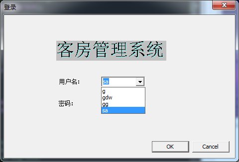
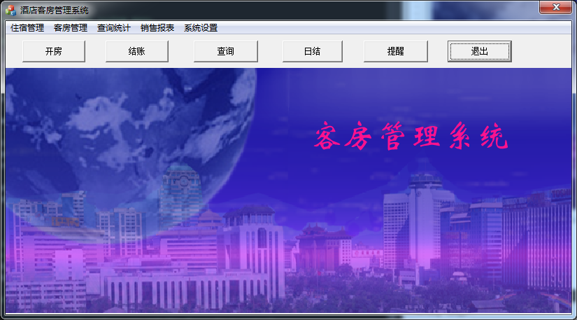

# 酒店客房管理系统

开发工具：

* Vistual Studio 2012
* MFC
* Sql Server 2005

## Sql Server 2005 使用配置

[sql server 数据库配置方法](./dataBaseConfig/config.md)

## 界面效果

* 登录界面

* 主界面

## 主要功能

* 住宿管理模块

住宿管理模块包括入住登记、退房结帐 2 部分。 

* 客房管理模块

客房管理模块包括客房设置、客房查询 2 部分。

* 查询统计模块

查询统计模块包括住宿查询、退宿查询 2 部分。

* 报表管理模块

报表管理模块包括预售报表、销售统计 2 部分。

* 系统设置模块

系统设置模块包括新增用户、密码设置2部分。

