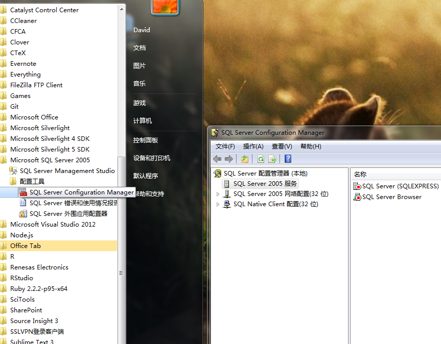
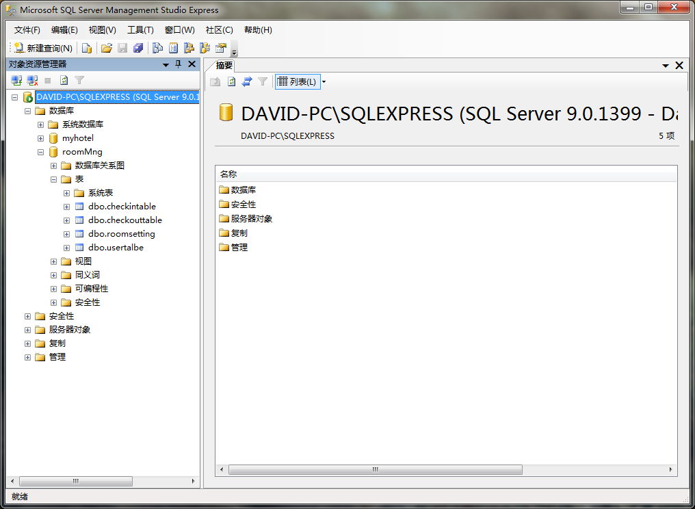
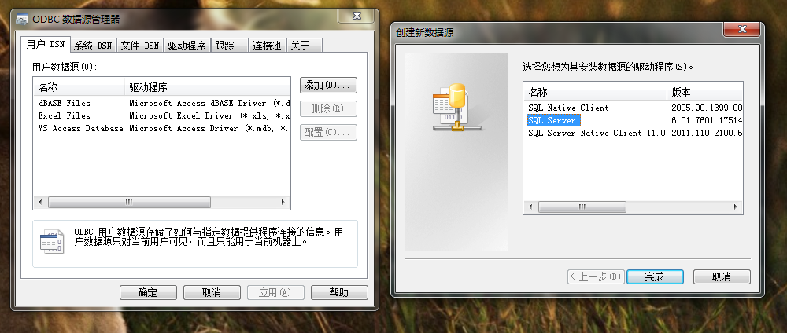
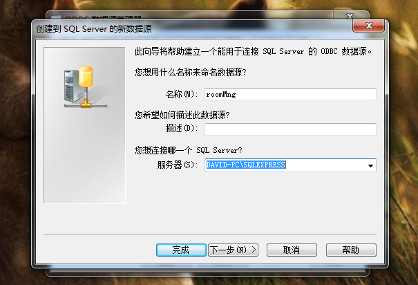
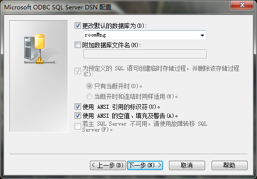
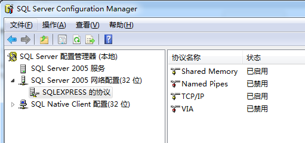

# 酒店客房管理系统程序数据库配置

## 1. 安装 sql server 2005

文件 `SQLEXPR_CHS.EXE` 是用来安装 sql server 2005 的。

安装完之后在开始菜单栏看到 `SQL Server Configuration Manger`，点击后得到如下图所示的管理界面。

文件 `SQLServer2005_SSMSEE_x64.msi` 是用来安装 `SQL Server Management Studio` 的，安装过程只需要修改安装路径即可。

使用它管理数据库非常简单。

它的界面效果如下：

## 2. 使用 SQLserver Mangement studio 添加数据库文件

打开 `SQL Server Management Studio` 程序，右键点击 `数据库`，点击 `附件`, 选择数据库文件 `roomMng.mdf`。

打卡数据库后的效果如上面那张图所示。

## 3. 配置数据源

控制面板-->管理工具-->数据源（ODBC）

出现下图：

在`ODBC 数据源管理器` 点击 **添加** 按钮，创建数据源。

出现下图

`名称栏` 填写数据库名 `roomMng` ，`服务器栏` 填写服务器名。填写时可以参考下图

**注意更改默认的数据库为你指定的数据库名， 如下图**

剩下的保持默认选项，总执行 `下一步` 直到完成。

接下来就可以运行调试程序了。

## 常见问题

如果连接不上 Sql Server 数据库，可能的原因是 SQL Server 没有开启 TCP/IP 协议。进入如下页面启用 TCP/IP 协议。

